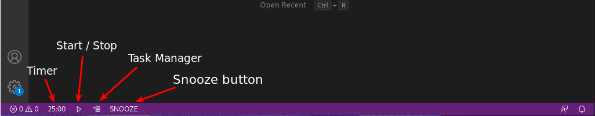
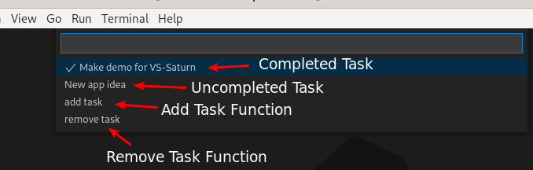
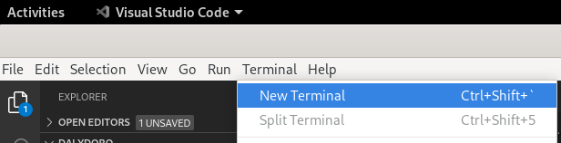
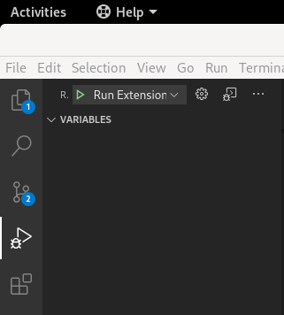

# dalydoro README

 VS-Saturn is an addon to VSCode that aids with time management by integrating routine breaks into a work period. Users can start a 25-minute timer where they will work to the best of their ability until the timer has completed. The user will be notified upon the timer’s completion and a checkmark will be placed next to the timer. They will be prompted to start a five-minute break period timer where they should rest their brain and refocus doing something they enjoy. Subsequently, the user will be prompted to start another 25-minute timer and this process of alternating work and break periods will be repeated until four work periods have been completed. After the fourth work period, a 30-minute extended break period timer can be started. Normal work and break periods will follow until another four work periods have been completed.

At any point, the user can check the time remaining, pause, reset, or snooze the timer. Snoozing will extend the current timer by five minutes and can be done up to four times for break periods and as many times as the user wishes for work periods. All other timers including the five-minute snooze and the notification for when a timer has been completed can be configured in the settings. Possible notifications include changing the theme of VSCode, a pop-up notification with or without an audible cue, an audible cue, or making the icon on the taskbar for VSCode flash.

To aid productivity, the user’s goals and tasks for work periods can be tracked in a list. Tasks can be added, rearranged, checked off, and deleted from the list. The user should add tasks that will be completed in the work period, rearrange them according to their priority, and check them off upon completion. All tasks, the progression of the current timer, number of checkmarks, and previously configured settings will be saved if VSCode is closed.

## Features

* **Timer:** VS-Saturn includes a timer on the status bar which will display the time left in the current work or break period.
* **Start / Stop Button:** To the right of the timer is the start stop button. This allows the user to easily start or stop the timer.
* **Task Manager:** Next to the start / stop button is the task manager button. By clicking this button you can see a list of current tasks, and at the bottom of the list, options to add and remove tasks. Users are also able to mark tasks as complete through the task manager.
    
    * To add a task, move your cursor over the 'add task' option, and press enter. You can then enter your task and hit enter to add it to your task list.
    * To remove a task, move your cursor over the 'remove task' option, and press enter. You can then move your cursor over the current tasks and press enter to select a task to be removed.
    * To mark a task as complete, move your cursor over a task, and then hit enter to mark it as complete. Tasks that are marked as complete are displayed with a checkmark.
* **Snooze:** To the right of the task manager is the snooze button. This will add five minutes to the current timer. 

## Requirements

Users must have the following:

* [VS Code](https://code.visualstudio.com/)
* [npm](https://www.npmjs.com/get-npm)
* Repository [cloned](https://www.howtogeek.com/451360/how-to-clone-a-github-repository/) from: https://github.com/UML-COMP-4110-VS-SATURN-1/dalydoro

## How to run VS-Saturn

* Once the above requirements have been satisfied, the repository should be opened in VS Code.
* Open a terminal in VS Code by clicking 'terminal' and then 'new terminal. 
* In the newly opened terminal, enter the command: 'npm init'
* After running the command, click run on the left side bar, then the arrow next to 'run extension' 
.
* A new VS Code window will now open with VS-Saturn running!

### For more information

* [Read More About VS-Code Here](https://uml-comp-4110-vs-saturn-1.github.io/website/)
* [Learn About the Pomodoro Technique](https://www.forbes.com/sites/bryancollinseurope/2020/03/03/the-pomodoro-technique/?sh=2555b3263985)

**Enjoy!**
